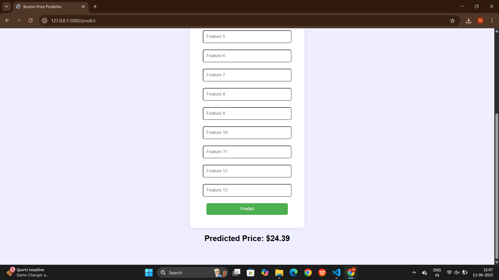

# 🏠 Boston House Price Prediction Web App

This is a machine learning web application that predicts Boston house prices using Linear Regression. The UI is built using Flask and styled with HTML/CSS.

---

## 🚀 How to Run Locally

1. Install packages:
```bash
pip install flask scikit-learn pandas numpy

2. Run model and app:
python model.py
python app.py


3. Open browser:
http://127.0.0.1:5000/


---


## 📸 Screenshot




---

## 👩‍💻 Author

[Monisha Krishnamoorthy](https://github.com/monishakrishnamoorthy7)
